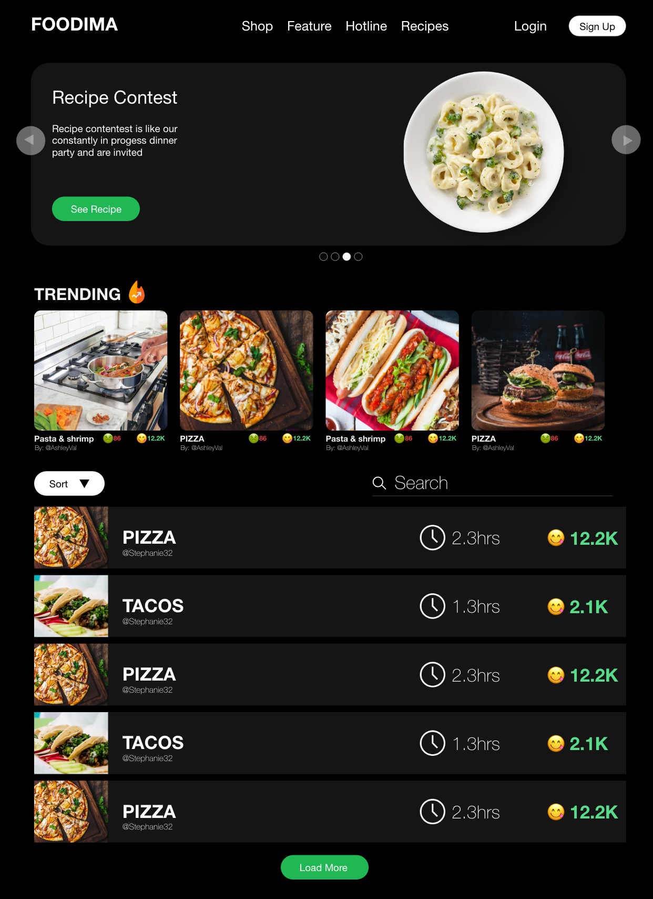
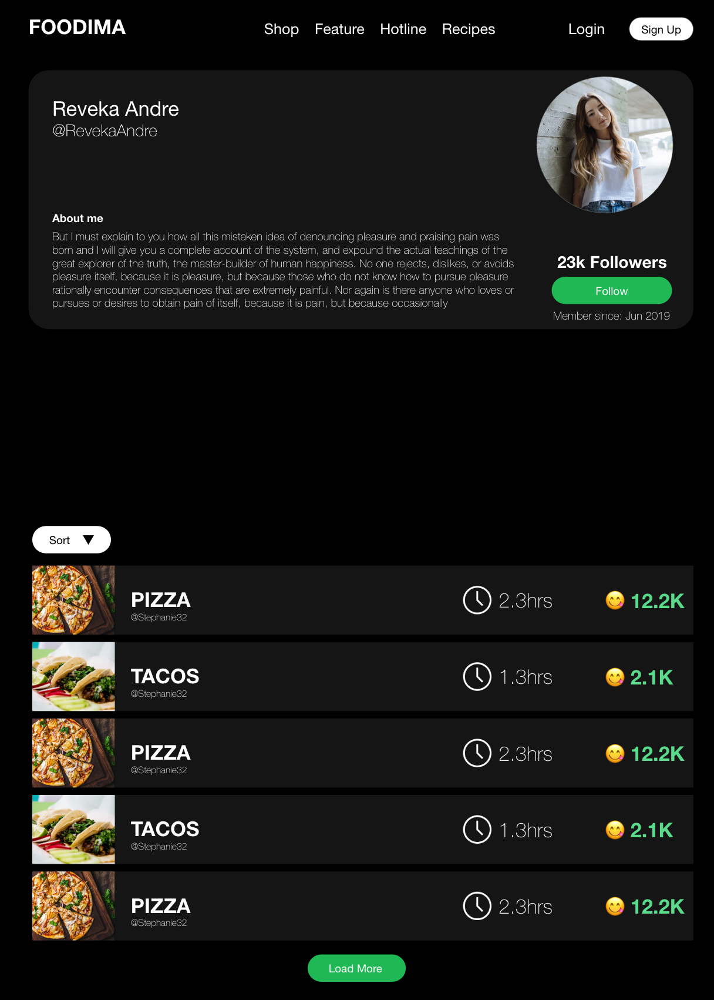
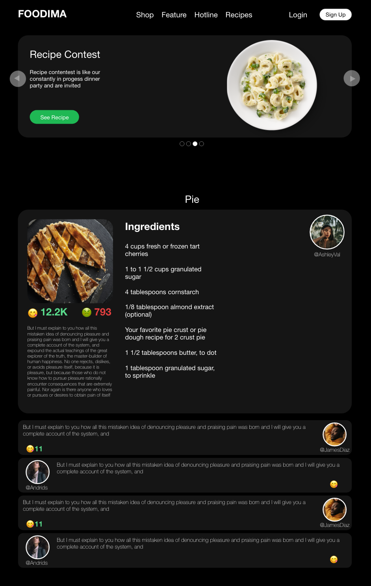

# GoFoodApp
> Short blurb about what your product does.




## Our Slack GroupChat

https://gofoodapp.slack.com/?fbclid=IwAR3u_dKv-K2x7a7gVMDVFbrIWwKyu9HRYgGwbLDrdVG7KMSwpBJAAF4aLvc

## Back-End project (must be use in order to run the App)
https://github.com/Edwinvalerio/foodrecipes-backEnd

## Installation

OS X & Linux:

```sh
npm install 
```

Windows:

```sh
npm install
```

## Usage example

to start the app

```sh
npm start
```

_For more examples and usage, please refer to the [Wiki][wiki]._

## Development setup

Describe how to install all development dependencies and how to run an automated test-suite of some kind. Potentially do this for multiple platforms.

```sh
make install
npm test
```

## Release History

* 0.0.1
    * CHANGE: Update Home Page


## Contributing

1. Fork it (<https://github.com/Edwinvalerio/foodrecipes>)
2. Create your feature branch (`git checkout -b feature/fooBar`)
3. Commit your changes (`git commit -am 'Add some fooBar'`)
4. Push to the branch (`git push origin feature/fooBar`)
5. Create a new Pull Request

<!-- Markdown link & img dfn's -->
[npm-image]: https://img.shields.io/npm/v/datadog-metrics.svg?style=flat-square
[npm-url]: https://npmjs.org/package/datadog-metrics
[npm-downloads]: https://img.shields.io/npm/dm/datadog-metrics.svg?style=flat-square
[travis-image]: https://img.shields.io/travis/dbader/node-datadog-metrics/master.svg?style=flat-square
[travis-url]: https://travis-ci.org/dbader/node-datadog-metrics
[wiki]: https://github.com/yourname/yourproject/wiki

<p>Home page</p>


<p>Profile</p>


<p>Recipe</p>

